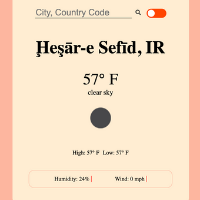

# Weather App
A a weather app utilizing the OpenWeatherMap API. The project is built using HTML5, CSS3, JavaScript, and Fetch. The default temperature is Fahrenheit and miles er hour wind speed. Click on the toggle button to see temperature in Celcius and wind speed in meter per second.

To use the app you need an api key from OoenWeatherMap.com under the free subscription. Enter the following in line 10 in the app.js file: http://api.openweathermap.org/data/2.5/weather?q=${location[0]},${location[1]}&units=imperial&appid={YourAPIKey}

The app only accepts city name and country code. The API is not 100% accurate therefore cities with the same name within the same country will not properly display.

## Sources
* Font Awesome
* OpenWeatherMap: https://openweathermap.org/
* Toggle button: Codingflag https://www.youtube.com/watch?v=ZZoA3MjgASQ

